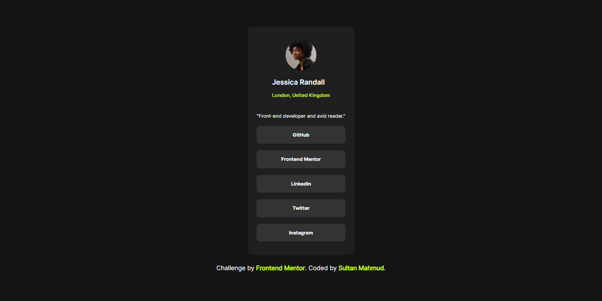
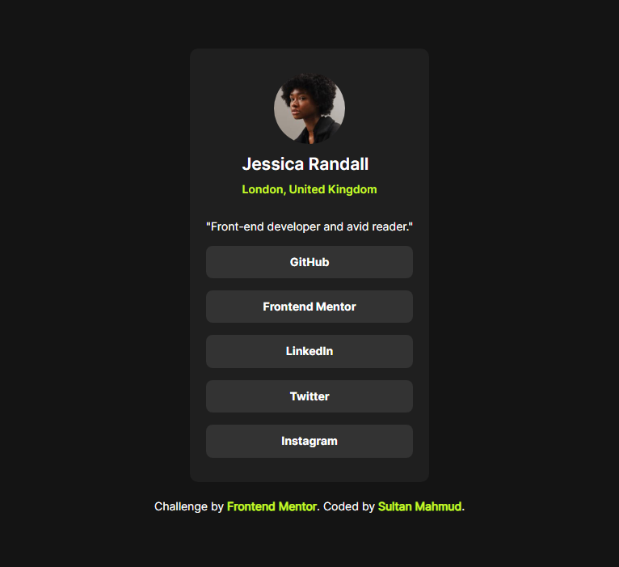

# Frontend Mentor - Social links profile solution

This is a solution to the [Social links profile challenge on Frontend Mentor](https://www.frontendmentor.io/challenges/social-links-profile-UG32l9m6dQ). Frontend Mentor challenges help you improve your coding skills by building realistic projects. 

## Table of contents

- [Overview](#overview)
  - [Screenshot](#screenshot)
  - [Links](#links)
  - [Built with](#built-with)
- [Author](#author)

## Overview
  - This is a link profile single page application. With the help of this app you can easily navigate your social medias.

### Screenshot
#### desktop preview
.
#### mobile preview
.

### Links

- Solution URL: [Solution URL](https://social-link-profile-eight-orcin.vercel.app/)
- Live Site URL: [Live URL](https://social-link-profile-eight-orcin.vercel.app/)

### Built with

- Semantic HTML5 markup
- CSS custom properties
- Flexbox
- Mobile-first workflow

## Author

- Facebook - [My Facebook Profile](https://www.facebook.com/sultanmahmud.dev)
- Frontend Mentor - [@developer-sultan](https://www.frontendmentor.io/profile/developer-sultan)
- Twitter - [@sultanmahmud404](https://x.com/sultanmahmud404)
